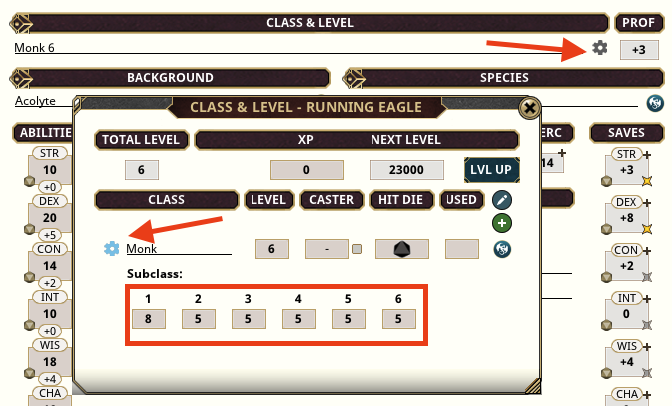

# Life Ledger

**Current Version:** ~dev_version~
**Updated:** ~date~

> **NOTE:** Upon first loading, this extension will attempt to resolve each PC's current total hit points into individual rolls. If a discrepancy is detected, a notification will appear upon opening the character sheet. This extension disables editing of max hit points, which are auto-calculated and should never be altered. Temporary adjustments to max hit points can be performed using adjusted hit points. To resolve discrepancies in max hit points, refer to the image below.
> 

## Features

- **HP Tracking:** Monitors individual HP values gained at each level, automatically adjusts based on constitution changes, and tracks maximum HP adjustments.
  - View and edit values in the Class & Level window.
  - Manual class level changes take effect after focus is lost.
- **HP Calculation Options:** Choose whether to use average HP or roll for HP at level up.
- **Display Options:** Toggle between showing Wounds or Current Hit Points.
  - Inspired by the [Current HP](https://www.fantasygrounds.com/forums/showthread.php?44140-Current-HP-Extension-for-5E-Ruleset) extension by Tielc and zuilin.
- **NPC Health Fields:** Control extra health fields for hit dice and death saving throws for NPCs, with options for per-NPC adjustments via right-click on NPC sheets.
- **Constitution Adjustments:** Both permanent and effect-based constitution changes adjust HP accordingly.
- **Heal Action:** A new Heal action type increases maximum HP.
- **NPC Tracker Enhancements:** Added fields for Wounds, Temp HP, HP Adjustment, Hit Dice, and Death Saves on NPC sheets, with an option to hide them.
- **Configurable Abilities:** Abilities, Class Features, Ancestral Traits, and Feats can grant hit points (e.g., the Tough feat). Right-click on the ability's window to enable and set the desired value.

## Special Damage Types

| Descriptor | Notes|
| --- | --- |
| `hsteal` | The attacker is healed for half of the damage dealt to the target. |
| `hstealtemp` | The attacker gains temporary hit points equal to half of the damage dealt. |
| `maxhp` | The target's maximum hit points are reduced by the damage dealt. |
| `steal` | The attacker is healed for the damage dealt to the target. |
| `stealtemp` | The attacker gains temporary hit points equal to the damage dealt. |
| `transfer` | The damage is dealt to the attacker, and the target is healed by the damage taken. |

> **Note:** For `steal`, `stealtemp`, and `transfer` damage types, if followed by a (N) damage type (where N is any positive number), the secondary effect is scaled by N. For example, `steal, 0.5` is the same as `hsteal`.

## Modifier Tags

| Modifier | Value | Descriptors | Notes |
| --- | --- | --- | --- |
| `HD` | (D) | max | Adds (D) when the hit die is rolled.|
| `HDMULT` | (N) | (-) | The result of a hit die roll multiplied by (N). **Note:** Extra dice added by HD effects are not multiplied, but extra flat numbers are. |
| `HDRECOVERY` | (N) | (-) | (N) additional hit dice recovered on long rest. |
| `SHAREDMG` | (N) | (-) | (T) Damage received by an Actor shared with another Actor by proportion (N). **See Note**  |
| `SHAREHEAL` | (N) | (-) | (T) Healing received by an Actor shared with another Actor by proportion (N). **See Note** |

- **(D)** = Dice and numbers supported for value attribute.
- **(N)** = Only numbers supported for value attribute.
- **(-)** = Neither number nor dice supported for value attribute.
- **(T)** = Effects can be targeted to apply only to modifiers against certain opponents.
- **max** = Maximizes the die roll.
- **Note** = When the effect is targeted, the target receives the shared damage or healing. When not targeted, the source receives the shared effect.

## Examples

### Damage Types

| Power [Source] | Code | Notes |
| --- | --- | --- |
| Bite [Vampire] | DMG: 1d6+4 piercing + 3d6 necrotic, maxhp, steal | |
| Life Transference [Spell] | DMG: 4d6 necrotic, transfer, 2 | |
| Vampiric Touch [Spell] | DMG: 3d6 necrotic, hsteal | |

### Effects

| Power [Source] | Effect Code | Duration/Target/Expend | Notes |
| --- | --- | --- | --- |
| Warding Bond [Spell] | Warding Bond; AC: 1; SAVE: 1; RESIST: all; SHAREDMG: 1 | Duration=1 hr | Can be improved to range check with Aura |

## Options

| Name | Default | Options | Notes |
| --- | --- | --- | --- |
| Per User: HP: Display Mod | Wounds | Wounds/Current HP | Wounds shows current wounds in the Combat Tracker; Current HP shows remaining HP. |
| NPC: Show Extra Health Fields | On | On/Off | On adds extra fields to the NPC sheet. |
| PC: Clear HP Adjust on Long Rest | On | On/Off | On clears any adjusted HP an Actor has when taking a Long Rest. |
| PC: HP on Level Up | Average  | Average/Roll | Average means static average HP gained on level up; Roll means HP gained will be rolled. |

## Attribution

Based on **Constitutional Amendments** by MeAndUnique.

Icon based on [Archive Register](https://game-icons.net/1x1/delapouite/archive-register.html) by Delapouite, modified by rhagelstrom with permission ([CC 3.0](https://creativecommons.org/licenses/by/3.0/)).

SmiteWorks retains rights to code sections copied from their rulesets, used with permission for Fantasy Grounds community development.
**'Fantasy Grounds'** is a trademark of SmiteWorks USA, LLC.
**'Fantasy Grounds'** is Copyright 2004-2024 SmiteWorks USA LLC.
